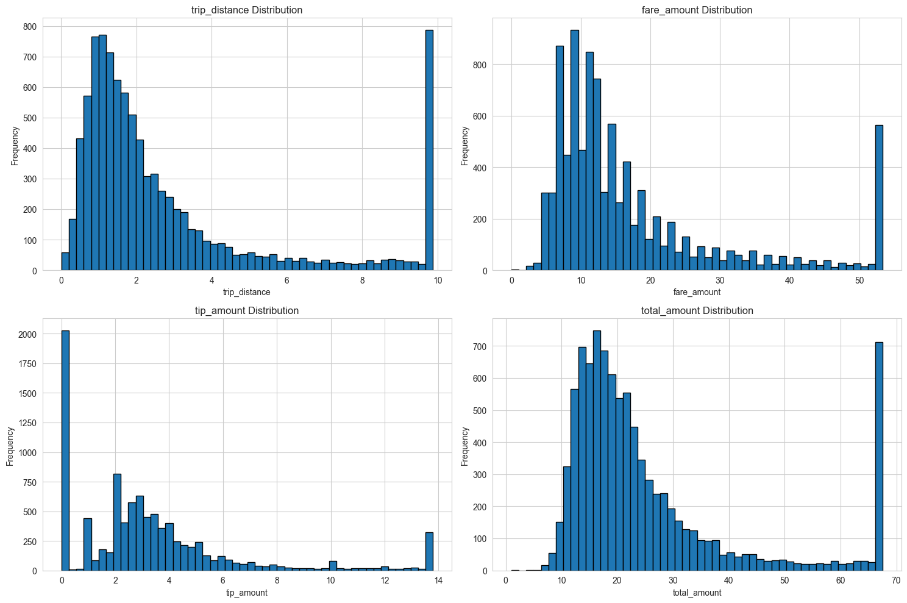
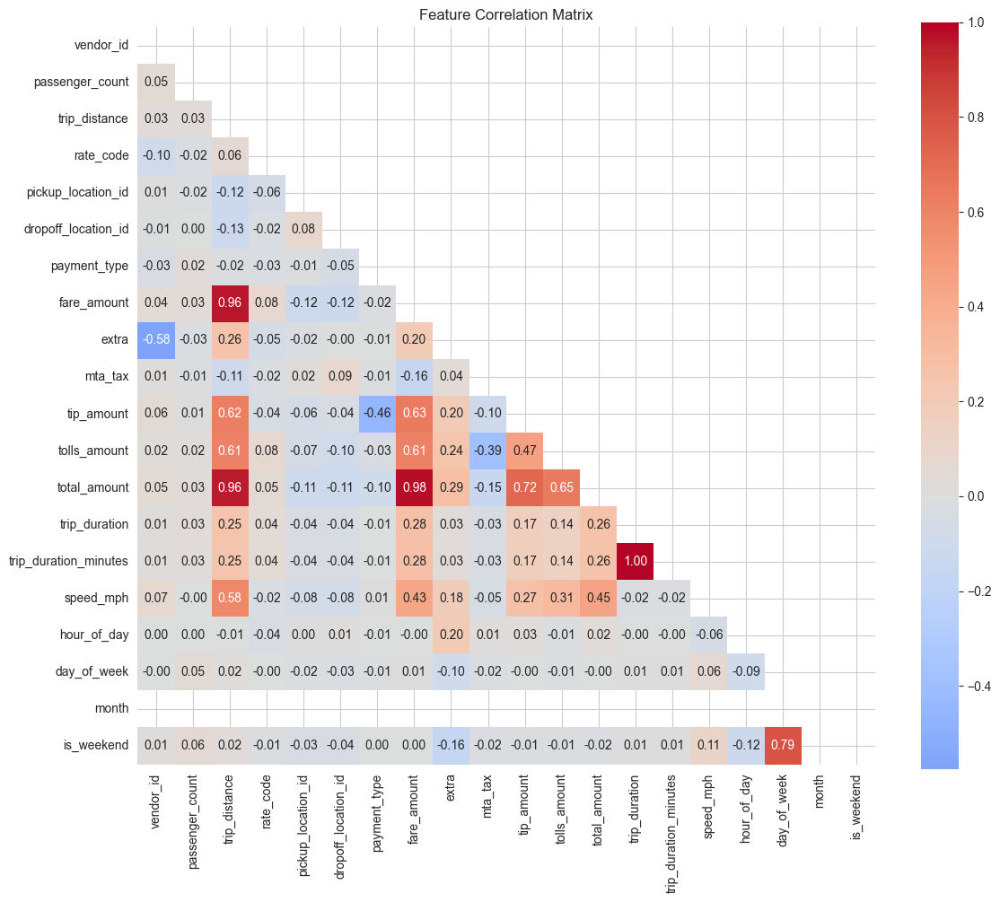
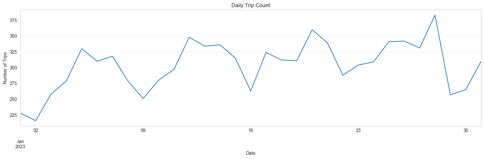

# Data Quality Report: processed_taxi_trips

**Generated**: 2026-01-05 03:51:04

---

## Executive Summary

- **Total Rows**: 9,418
- **Total Columns**: 23
- **Memory Usage**: 2.10 MB
- **Date Range**: 2023-01-01 00:05:31 to 2023-01-31 23:33:11
- **Days Covered**: 30

---

## Data Quality Metrics

### Missing Values

- **Total Null Values**: 0
- **Columns with Nulls**: 0

### Outliers (IQR Method)

| Column | Count | Percentage | Bounds |
|--------|-------|------------|--------|
| passenger_count | 2,266 | 24.06% | [1.00, 1.00] |
| trip_distance | 1,222 | 12.98% | [-2.21, 6.58] |
| rate_code | 415 | 4.41% | [1.00, 1.00] |
| payment_type | 1,715 | 18.21% | [1.00, 1.00] |
| fare_amount | 986 | 10.47% | [-8.20, 36.60] |
| extra | 134 | 1.42% | [-3.75, 6.25] |
| mta_tax | 47 | 0.50% | [0.50, 0.50] |
| tip_amount | 674 | 7.16% | [-3.80, 9.00] |
| tolls_amount | 672 | 7.14% | [0.00, 0.00] |
| total_amount | 1,058 | 11.23% | [-4.07, 48.05] |
| trip_duration | 540 | 5.73% | [-541.50, 2054.50] |
| trip_duration_minutes | 540 | 5.73% | [-9.03, 34.24] |
| speed_mph | 500 | 5.31% | [-0.52, 21.94] |

---

## Validation Results

- **Total Checks**: 15
- **Passed**: 15
- **Failed**: 0

---

## Summary Statistics

| Statistic | vendor_id | passenger_count | trip_distance | rate_code | pickup_location_id |
|-----------|----------|----------|----------|----------|----------|
| mean | 1.75 | 1.39 | 2.88 | 1.40 | 166.10 |
| std | 0.43 | 0.87 | 2.76 | 5.80 | 63.61 |
| min | 1.00 | 1.00 | 0.01 | 1.00 | 4.00 |
| 25% | 1.00 | 1.00 | 1.09 | 1.00 | 132.00 |
| 50% | 2.00 | 1.00 | 1.80 | 1.00 | 162.00 |
| 75% | 2.00 | 1.00 | 3.29 | 1.00 | 234.00 |
| max | 2.00 | 6.00 | 9.88 | 99.00 | 265.00 |

---

## Visualizations

### Distributions

### Correlation

### Timeseries

---

## Recommendations

- **Outliers**: 10,769 outliers detected across numeric columns. Review and cap if necessary.

---

*Report generated by Smart Analytics Data Quality System*
